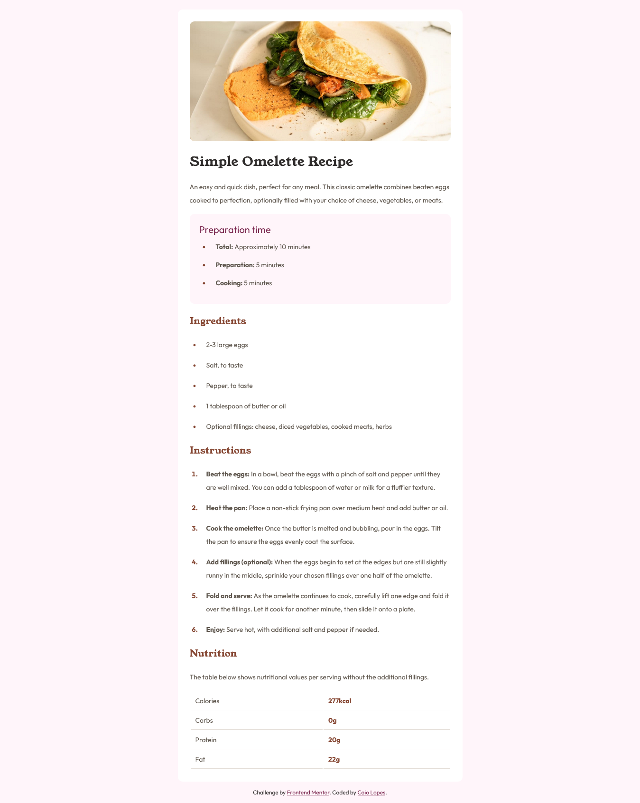
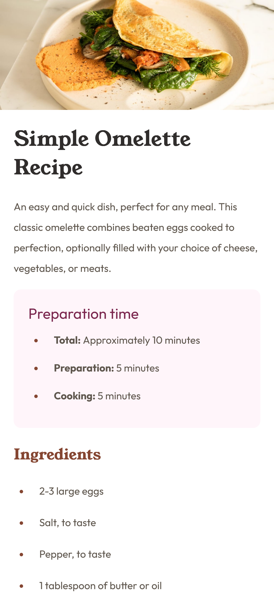

# Frontend Mentor - Recipe page solution

Esta é minha solução para o desafio [Recipe page challenge](https://www.frontendmentor.io/challenges/recipe-page-KiTsR8QQKm). no Front-End Mentor.

## Conteúdo

- [Overview](#overview)
  - [Screenshot](#screenshot)
  - [Links](#links)
- [Sobre o projeto](#sobre-o-projeto)
  - [Feito com](#feito-com)
  - [O que aprendi](#o-que-aprendi)
  - [Desenvolvimento contínuo](#desenvolvimento-contínuo)
  - [Recursos Extras](#recursos-extras)
- [Autor](#autor)
- [Agradecimentos](#agradecimentos)

## Overview

### Screenshot

- **Desktop | width >= 1366px**

- **Smartphones | width: 375px**

### Links

- Projeto URL: [Repositório GitHub](https://github.com/CaioLopes5556/MySolution-recipe-page-main)
- Live Site: [Deploy do Projeto](https://caiolopes5556.github.io/MySolution-recipe-page-main/)

## Sobre o projeto

### Feito com

- Semantic HTML5 markup
- CSS custom properties
- Flexbox

### O que aprendi

Este foi o primeiro desafio do Front-End Mentor que senti a necessidade de utilizar Media Queries para tornar o design da página mais responsivo.

Aprendi também alguns truques como a utilização de `max-width: 100%` para ajustar o conteudo principal da página totalmente a largura do dipositivo e deixa-lo fiel ao design que foi proposto para mobile.

Também pratiquei a criação de tabelas em HTML e suas estilizações no CSS.

### Desenvolvimento Contínuo

Acredito que nos próximos desafios vou precisar praticar mais técnicas de responsividade nas páginas e formas de posionamento de elementos.

### Recursos Extras

- [MDN Web Docs](https://developer.mozilla.org/en-US/docs/Web/CSS)

Este site me tirou algumas dúvidas durante o desenvolvimento do projeto.

## Autor

- Frontend Mentor - [@CaioLopes5556](https://www.frontendmentor.io/profile/CaioLopes5556)
- Linkedin - [@caio-silva-42848a236](https://www.linkedin.com/in/caio-silva-42848a236)

## Agradecimentos

Gostaria de agradecer a comunidade do Front-End Mentor por todas as dúvidas tiradas dos ultimos projetos, está ajudando muito!
